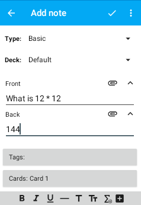

# شاشة إضافة ملحوظة

<!-- toc -->

*_ملاحظة:_* _يفترض هذا القسم وما بعده أنك تفهم معنى
[الملحوظات، والحقول، وقوالب البطاقات، وأنواع الملحوظات](https://docs.ankiweb.net/getting-started.html#notes--fields)_.

لإضافة ملحوظة جديدة، انقر زر **+** أسفل قائمة الرزم واختر **إضافة**.

تتوفر الميزات التالية في شاشة إضافة ملحوظة:

### النوع
يسمح لك باختيار نوع الملحوظة التي تريد إضافتها.
إن نوع **أساسي** يفي بالغرض في معظم الأحيان، لكن إذا كنت تريد بطاقة إضافية معكوسة مثلًا
(تظهر حقل **خلف** أمام البطاقة)، تستطيع اختيار نوع ملحوظة **أساسي (مع بطاقة معكوسة)**.

### الرزمة
يسمح لك بتغيير الرزمة التي ستضاف إليها البطاقات.

### الحقول
أسفل مُحدِّد الرزمة هناك حقول الملحوظة (مثلًا لحقل ملحوظة **أساسي** حقلي **أمامي** و**خلفي**).
عند النقر على حقل، تظهر لوحة مفاتيح تسمح لك بإدخال معلومات.

### أزرار الوسائط
بجانب كل حقل هناك أيقونة إرفاق تسمح لك بإضافة وسائط إلى ملحوظتك
(هذه الميزة في الطور التجريبي حاليًا). زر إضافة صورة يسمح لك بإضافة صور من خلال كاميرا جهازك
(إذا كانت متوفرة)، أو من خلال مكتبة الصور. خيار تسجيل الصوت يسمح لك بتسجيل صوتك
ووضعه في حقل. يسمح لك المحرر المتقدم بالبحث عن ترجمات أو ملفات نطق على الإنترنت.

### الوسوم
يفتح نافذة تسمح لك بإضافة الوسوم وحذفها من الملحوظة.

### البطاقات
يظهر أسماء البطاقات التي ستُولَّد من نوع الملحوظة المحدد. يؤدي النقر على هذا الزر
إلى فتح نافذة تسمح لك بمعاينة الشفرة المصدرية لقالب بطاقة النوع المحدد. من هناك تستطيع تحرير
القوالب ومعاينتها وإضافتها وحذفها. انظر قسم
[البطاقات والقوالب](https://docs.ankiweb.net/templates/intro.html)
في دليل أنكي للحاسوب لمزيد من المعلومات حول قوالب البطاقات.

اضغط ضغطًا مطولًا في حقل ما لإضافة عبارة ملء فراغات حول النص المحدد، أو عبارة فارغة إذا لم يكن هناك نص محدد.

بعد الانتهاء من إدخال محتويات الملحوظة، انقر زر علامة صحيح في شريط التطبيق في الأعلى
لإضافتها إلى مجموعتك. أو كبديل، إذا أردت الرجوع إلى ما كنت تفعله بدون الحفظ، تستطيع النقر على
أيقونة التطبيق أو زر الرجوع.
