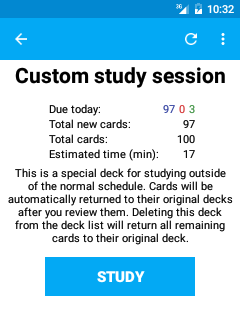

# شاشة موجز الرزمة

<!-- toc -->

في قائمة الرزم، إذا ضغطت على منطقة العدادات ستنتقل إلى شاشة موجز الرزمة.
تظهر هذه المنطقة على يمين قائمة الرزم دائمًا في الأجهزة اللوحية.

تستطيع رؤية موجز للرزمة هنا، وإنشاء جلسات دراسة مخصصة، وإعادة إنشاء / إفراغ الرزم المفلترة، وتغيير خيارات الرزمة.
يأخذك زر الدراسة عندما يكون مرئيًا إلى شاشة الدراسة لتلك الرزمة.

## شريط التطبيق
تعتمد الأيقونات التي تظهر هنا على ما إذا كانت الرزمة عادية أم مفلترة.

### الرزم العادية

#### الدراسة المخصصة
يسمح لك الضغط على أيقونة المفتاح بإنشاء جلسة مخصصة، للمراجعة الإضافية خارج
الجدول المعتاد، أو دراسة بطاقات معينة فقط مثلًا. انظر قسم [الرزم المفلترة](filtered-deck.md) لمزيد من المعلومات.

### الرزم المفلترة

#### إفراغ الرزمة
يؤدي النقر على زر الضرب إلى إفراغ كل البطاقات في الرزمة المفلترة الحالية (يعيدها إلى رزمها الأصلية).

#### إعادة إنشاء الرزمة
يؤدي النقر على زر إعادة إنشاء إلى إعادة إنشاء الرزمة المفلترة الحالية
بناءً على الإعدادات المخصصة في خيارات الرزمة المفلترة.

### القائمة المنسدلة

#### خيارات الرزمة
تسمح لك بإعداد بعض الخيارات المتعلقة بالرزمة الحالية، مثل عدد البطاقات الجديدة
والمراجعات التي تعرض كل يوم.
الرجاء الاطلاع على [دليل الحاسوب](https://www.abdnh.net/anki-manual/deck-options.html)
لمزيد من المعلومات حول هذه الخيارات.

#### نكش
هذا الخيار مرئي فقط عندما يكون في الرزمة بطاقات مدفونة يدويًا أو تلقائيًا.
