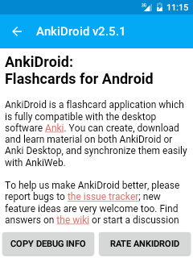

# دعم أنكيدرويد

## قبل السؤال

قبل طلب المساعدة، الرجاء محاولة البحث في [دليل أنكيدرويد](intro.md)،
و[قائمة الأسئلة المتكررة](https://github.com/ankidroid/Anki-Android/wiki/FAQ)،
و [دليل أنكي الرئيسي](https://www.abdnh.net/anki-manual) للمساعدة العامة بخصوص نظام أنكي وميزاته، وأي أمور غير محصورة بأنكيدرويد.

## دعم
إذا لم تجد ما تبحث عنه في الوثائق المذكورة في الأعلى، الرجاء زيارة واحد من المواقع التالية:

### أمور غير محصورة بأنكيدرويد 
أنكيدرويد (نسخة الأندرويد من أنكي) منشأ ومدار بشكل مستقل عن النسخ الأخرى. لإصدارات الحاسوب / الويب / أي أو إس، والأمور غير المحصورة بأنكيدرويد،
الرجاء زيارة [موقع دعم أنكي الرئيسي](https://forums.ankiweb.net).

### أسئلة أنكيدرويد 
للأسئلة والمساعدة بخصوص أنكيدرويد، الرجاء زيارة [منتدى المستخدمين](https://groups.google.com/forum/#!forum/anki-android)،
كما يمكنك إرسال أسئلتك إلى [عنوان البريد الإلكتروني العام](mailto:public-forum@ankidroid.org)
والمخصص للمنتدى إذا لم تكن تريد التسجيل في المنتدى.

### تقارير الأعطال وطلبات الميزات
لتقارير الأخطاء وطلبات الميزات، الرجاء الاطلاع على القائمة الحالية للمشاكل المفتوحة في [متعقب أعطال أنكيدرويد](https://github.com/ankidroid/Anki-Android/issues)،
وإذا لم تكن هناك منشورات تخص مشكلتك، أنشئ واحدًا جديدًا مع توفير أكبر قدر ممكن من المعلومات. لتقارير الأعطال،
الرجاء تضمين **معلومات التصحيح** أيضًا باتباع الخطوات التالية:

1. افتح قائمة التنقل بالنقر على الزر في أعلى يسار الشاشة
2. انقر **إعدادات**
3. انقر **خيارات متقدمة**
4. انقر **حول أنكيدرويد** في الأسفل
5. انقر زر **نسخ معلومات التصحيح** في الأسفل لنسخ المعلومات إلى الحافظة
6. إذا كنت تكتب تقرير العطل على هاتف محمول، الصق محتوى الحافظة في المنشور. كبديل، تستطيع لصق محتوى الحافظة في بريد إلكتروني جديد، وإرساله إلى نفسك، ثم نسخه ولصقه في تقرير العطل على حاسوبك.

**ملاحظة:** إذا لم تكن قادرًا على فتح التطبيق أبدًا، وبالتالي لا يمكنك الوصول إلى الإعدادات،
الرجاء الاطلاع على [هذه التعليمات](https://github.com/ankidroid/Anki-Android/wiki/Unopenable-collections).

إن معلومات التصحيح هذه مهمة لأنها تسمح لنا بمطابقة تقريرك مع معلومات تقارير الأعطال الداخلية عندنا.

### المساهمة في أنكيدرويد

إن أنكيدرويد مشروع مفتوح المصدر، والجميع مشجع على المساهمة (بما في ذلك غير المطورين)! لمعلومات حول كيفية المساهمة،
الرجاء الاطلاع على [صفحة ويكي المساهمة](https://github.com/ankidroid/Anki-Android/wiki/Contributing)،
وطرح أي أسئلة إضافية في [المنتدى الرئيسي](https://groups.google.com/g/anki-android).
