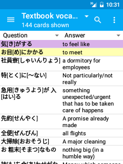

# Finding/Searching/Browsing

<!-- toc -->

You can search for or browse cards by tapping the **Card browser** button from the [navigation drawer](drawer.md).

The browser screen starts by displaying all the cards in the currently selected deck. You can search for cards in the selected deck by tapping the magnifying glass icon in the top. You can change the selected deck (or change to all decks) by choosing the deck from the dropdown list on the top left.

By default, the first column in the browser gives the text which will be shown on the question (i.e. front side) of the flashcard, and the second column shows the text from the answer (i.e. the back side) of the flashcard. 

The first column can also be configured to show the [sort field](https://docs.ankiweb.net/editing.html#customizing-fields) for a more compact display. The second column can be configured to show many different parameters by tapping the drop down menu in the column heading. 

Note that the content of the columns is dynamically calculated as your scroll through the list of the cards.

From the search results, you can tap on a card to edit it (see the [edit note section](editing-notes.md) above), or long-tapping on it will show a menu allowing you to perform the following actions:

#### Mark / unmark note
Add / remove the **marked** tag from the note. Cards with a marked note are highlighted in purple.

#### Flag card
Change or remove the color coded **flag** on the card. Cards with a flag are highlighted in the flags color.

#### Suspend / unsuspend card
Suspended cards are highlighted in yellow, and are not shown during review.

#### Delete note
Delete the note of the currently selected card, and all cards belonging to that note. This action cannot be undone without [restoring from backup](backups.md).

#### Preview
Render the currently selected card so that you can see what it looks like in the reviewer.

#### Select multiple cards
Long-tapping on a single card will select the single card. While that card is selected, if you long-tap on another card on your screen, then all of the cards between the first selected card and the last card will be selected. This allows for actions to be performed on multiple cards at once.

## Searching
AnkiDroid supports all the search strings that the desktop version of Anki does, allowing you to perform quite complex searches. Some examples:

#### tag:marked
show cards that with the tag **marked**
 
#### is:due
show only cards that are waiting for review
 
#### front:rabbit
show only cards where the front field is exactly **rabbit** 
 
#### flag:1
show only cards marked with a red flag

For a full list of the possibilities, please see the section in the [desktop manual](https://docs.ankiweb.net/searching.html).

Alternatively, some more commonly used filters (marked, suspended, and tagged cards) can be quickly applied without manually typing them by choosing them from the overflow menu. You can also save and recall common search queries from the menu.
