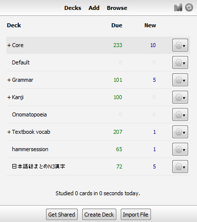

# Ankiとあわせて使う

Ankiには、AnkiWebという無料の同期サービスがあり、デッキをモバイル端末とPCで簡単に同期しておくことができます。もし何かの理由でこの同期サービスが使えない場合、USB接続を使うこともできますが、そちらの方法のほうが手間がかかります。

注意：AnkiDroidはAnkiやAnkiWebの開発・管理には関わっていません。AnkiDroidはAnkiをもとに作られましたが、Ankiから完全に独立したコミュニティー（ボランティアユーザーの集まり）によって開発・管理されています。

## クラウド経由の同期

AnkiWebを使う前に、まずアカウントを作成する必要があります(もし以前にAnkiWebを使ったことがあれば、飛ばしてください)。 [https://ankiweb.net](https://ankiweb.net) にアクセスし、「サインアップ」ボタンを押してください。AnkiWebにログインできたら、他端末内の既存のデッキのデータをAnkiDroidに入れたいのか、その逆にAnkiDroid内のデッキのデータをAnkiWebに出したいのかに応じて、以下の対応する説明に進んでください。

### 新規にインストールしたAnkiDroidに既存のデッキを同期する
以前に作成したAnkiのデッキがあり、新規にインストールしたAnkiDroidにそのデッキをコピーしたい場合、AnkiWebでの同期によってそれを行うことができます。その既存のデッキが入っている状態でAnki（または、別のスマートフォンやタブレットで使っているAnkiDroid）を起動してください。次に、デッキリスト画面右上の同期ボタン（２つの矢印が回転しているアイコン）を押してください。

もしAnkiWebを使うのが初めてであれば、IDとパスワードの入力が必要になります。それから、「AnkiWebにアップロード」ボタンを押してください。AnkiWeb上の空のコレクションが、既存のデッキで上書きされます。Ankiはデッキ中のカードとメディアファイル（画像・音声・動画）を全てアップロードするので、メディアファイルがたくさんあれば、同期が完了するまで少し時間がかかるかもしれません。

データのアップロードが終了したら、既存のデッキのコピー先にしようとしている端末内のAnkiDroidを開き、[デッキリスト](deck-picker.md)画面のアクションバーにある「**同期**」ボタンをタップしてください。AnkiWebのIDとパスワードを入力すると、AnkiDroidはAnkiWeb上のすべてのカードとメディア情報をダウンロードし、アカウント情報を保存します。

もし、同期を実行する前にAnkiDroidにカードが存在している場合、AnkiWebからダウンロードするかAnkiWebにアップロードするかを選択するよう表示されるかもしれません。AnkiDroidに存在しているカードが消えてもいいという場合は、単に「ダウンロード」を選んでください。一方、AnkiWeb内のカード情報とAnkiDroid内のカード情報とを統合する必要がある場合は、操作を続行する前に [「同期で矛盾が生じた場合の処理」の節](ankiweb-conflicts.md) の内容を理解しておくことを強くおすすめします。

最初の同期が完了したら、あとはいつでも好きなときに同期ボタンを押して、データの変更分をクラウドと同期することができます。前回同期した時点からの差分だけが送信されるので、二回目以降の同期はずっと速くなります。

また、その後でPCのほうで新規カードを追加して、それをAnkiDroidに同期したくなった場合、ここまでと同様に操作することになります。つまり、PC上でまず同期して(あるいは、単にAnkiを終了してもよいです。設定を変えていなければ、終了時に自動的に同期されます)、それからAnkiDroidで同期ボタンをタップするわけです。

### AnkiDroidからPCに同期する

AnkiDroidの側からPCに同期する場合も、基本的にはPCからAnkiDroidに同期する場合と同様の操作を行いますが、順番が逆になります。

まず [デッキリスト画面](deck-picker.md) で、右上の同期ボタンを押します(丸い二本矢印のボタンです)。もしAnkiWebを使うのが初めてであれば、IDとパスワードの入力が必要になります。それから、最初に「アップロード」ボタンを押して、明示的にAnkiDroid上のデッキをAnkiにアップロードします。

同期が完了したら、Ankiを開いて、右上の同期ボタン(円の中にふたつ矢印があるボタンです)を押してください。AnkiDroidからアップロードされたデータをダウンロードします。
