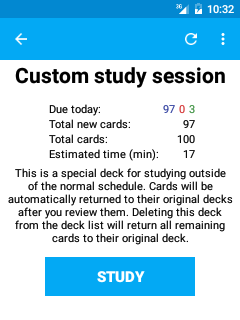

# デッキ概要画面

デッキリスト画面でデッキカウントの部分をタップすると、デッキ概要画面に移動します。（タブレット端末の画面では、このデッキ概要画面はデッキリストの右側に常に表示されています。）

この画面では、このデッキ内のカード枚数についての概要を見ること、カスタム学習セッションの作成、フィルターデッキ内カードの再構築・返却、学習オプションの変更、といったことができます。「学習開始」ボタンが表示されている場合は、そのボタンをタップすると、そのデッキの学習画面に移動します。

## アクションバー
アクションバーとは、画面上部の水色の部分を指します。デッキ概要画面のアクションバーに表示されるアイコンは、そのデッキが通常のデッキなのかフィルターデッキなのかによって異なります。通常のデッキの場合は、次のアイコンが表示されます。

#### カスタム学習
スパナ（レンチ）のマークのアイコンです。タップすると、通常のスケジュール(訳注：Ankiシステムによって自動的に設定される)を超えて学習をしたり、デッキの中の特定のカードだけについて学習したり、といったカスタム学習セッションを作成することができます。詳細は [「フィルターデッキ」の節](filtered-deck.md) を参照してください。

一方、フィルターデッキの場合は、次のアイコンが表示されます。

#### 全て戻す
「×」マークのアイコンです。タップすると、そのフィルターデッキ内の全カードを、それぞれの元のデッキに戻して、フィルターデッキを空にします。

#### 再構築
一つの矢印が回転しているアイコンです。タップすると、デッキオプションの「フィルター」の項目の設定にしたがって、カードを改めて抽出し直します。

右端の「その他」ボタンを押すと表示される機能は以下の通りです。

#### デッキ オプション
選択中のデッキに関係するいくつかのオプションを設定できます。
例えば、新規カードや復習カードの、1日あたりの表示枚数などがここで設定できます。
詳細は、 [Ankiのマニュアルのデッキオプションの項目](http://wikiwiki.jp/rage2050/?2.0%2FDeckOptions) を参照してください。
