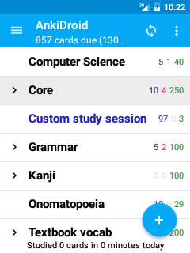

# デッキリスト

*注意：* この節の内容は、Ankiにおける [デッキとカード](http://wikiwiki.jp/rage2050/?2.0%2FTheBasics) がどういったものなのかを理解していることを前提としています。

AnkiDroidを起動すると、デッキ（＝カードのセット）のリストの画面が表示されます。あなたのカードは全て、このリスト内のデッキに含まれています。この画面では以下のような操作ができます。

## 追加ボタン
画面右下の水色の大きな「＋」ボタンは、AnkiDroidに新しいコンテンツを追加するために使います。このボタンを押すと次の3つのオプションが表示されます。これらの操作は [チュートリアル動画](https://www.youtube.com/watch?v=F2K1gOSdIZA)で見ることができます。

#### ノートを追加  
新しいカード（のためのノート）をAnkiDroidで作りたい時にこのオプションを選んでください。「ノート」と「カード」はAnkiでは特殊な意味を持っています。これは [Ankiのマニュアルの「基本」の節](http://wikiwiki.jp/rage2050/?2.0%2FTheBasics)で説明されています。ノートを追加するための簡単な紹介であるチュートリアル動画を見てください。より詳しい情報は、この後の [「ノートの追加」](adding-notes.md) に記載されています。

#### 共有デッキを取得
他のユーザーが提供したデッキ（＝カードのセット）をダウンロードするために、インターネット上の「AnkiWeb」のページを表示します。
 1. ネットに接続されていることを確認する		
 2. デッキリスト画面の右下にある、「＋」印の丸いボタン（追加ボタン）をタップし、このボタン（「共有デッキを取得」）をタップする。AnkiWebが開く		
 3. カテゴリーから選択するか、検索語を入力する		
 4. 試してみたいデッキの「Info」をタップ		
 5. 下までスクロールし、「Download」をタップ		
 6. ブラウザがダウンロードを開始し、終了すると完了の通知が表示されるので、それをタップ		
 7. AnkiDroidの画面に戻り、確認のダイアログが表示される。「追加」ボタンをタップ		
 8. インポートが終了次第、学習準備完了

#### デッキを新規作成
新しい、空のデッキを作成します。
 1. デッキリスト画面の右下にある、「＋」印の丸いボタン（追加ボタン）をタップし、このボタン（「デッキを新規作成」）をタップする。
 2. デッキに名前を付ける（例：「英単語」）
 3. そのデッキに、上記の「ノートを追加」の説明に沿ってカードを追加する

これらの使い方のデモを [チュートリアル動画](https://www.youtube.com/watch?v=F2K1gOSdIZA) で見ることができます。
 
## アクションバー

AnkiDroidの各画面の上部には、他のアプリと同様にアクションバーが置かれており、ボタンがいくつか用意されています。デッキリスト画面のアクションバーからは次のような操作が可能です。

#### ナビゲーションメニューボタン
アクションバー左端のアイコン（「≡」の形のマーク）をタップすると [ドロワーメニュー](drawer.md) が表示され、主な画面にすばやくアクセスすることができます。

#### 同期ボタン
回転する矢印のボタンは、デッキをクラウドストレージと同期するために使います。
詳しくは [クラウドストレージからデッキを追加するところ](anki-desktop.md) で説明します。

#### 「その他」ボタン
アクションバー右端のアイコンをタップすると、比較的使用頻度の少ない操作のメニューが表示されます。これらの操作については後述します。

 ヒント:アクションバーのボタンを長押しすると、そのボタンの機能を示す文字が表示されます。（ナビゲーションメニューボタンと「その他」ボタンでは表示されません）

## 学習する
カードの学習を始めるには、そのカードが入っているデッキの名前の部分をタップしてください（10インチ以上のタブレットでは、その次に「学習開始」ボタンをタップしてください）。AnkiDroidが学習モードに移ります。

なお、選択中のデッキは、文字の背景が灰色となって強調されます。また、[フィルターデッキ](filtered-deck.md) は青色のフォントで強調されます。フィルターデッキについては後述します。

## その他のデッキの操作
デッキを長押しすると、デッキに対して可能なその他の操作のメニューが表示されます。

#### このデッキの名前を変更
デッキの名前を変えたいときにはこれを使ってください。

#### デッキ オプション
デッキオプションを使うと、デッキごとの学習オプションを設定することができます。
オプションの詳細については、 [Ankiのマニュアルの該当部分](http://wikiwiki.jp/rage2050/?2.0%2FDeckOptions) を参照してください。

#### カスタム学習
通常のスケジュール(訳注：Ankiシステムによって自動的に設定される)以外の学習をしたい際に便利な機能があらかじめ準備されています。例えば、一日の学習枚数の上限をその日だけ上げる、といったメニューがあります。詳細については [「フィルターデッキ」](filtered-deck.md) の節を参照してください。

#### このデッキを削除
デッキを削除したいときにはこれを使ってください(注意：この操作自体を取り消すことはできませんが、 [バックアップからデッキ全体の状態を戻す](backups.md) ことは可能です)。

#### このデッキをエクスポート
この機能は、デッキを他のユーザーと共有するために使うことができます。詳しくは [エクスポート](exporting.md) の節を参照してください。

#### 再構築 / 全て戻す
選択中のデッキが [フィルターデッキ](filtered-deck.md) の場合、「再構築」（カードの抽出条件によって再度カードを抽出し直す）と「全て戻す」（デッキ内のカード全てを元のデッキに戻す）、という選択肢も表示されます。

## デッキリスト上でタップ操作可能なエリア
デッキリスト上の各行は、タップ操作可能な3つのエリアに分かれています。

#### デッキ エキスパンダー
もし
[サブデッキ](http://wikiwiki.jp/rage2050/?2.0%2FTheBasics#h2_content_1_1)が使われている場合は、デッキエキスパンダーボタンがデッキの左端に表示されます。このボタンをタップすると、そのデッキのサブデッキを表示したり非表示にしたりすることができます。「˃」のアイコンは、そのデッキには非表示中のサブデッキがあり、それを表示する（展開する）こともできるということを意味し、「˅」のアイコンは、そのデッキのサブデッキを表示中であり、それを非表示にする（折りたたむ）こともできるということを意味します。これらのアイコンがない状態は、そのデッキにはサブデッキがないということを意味します。
なお、サブデッキは「上位デッキ名::サブデッキ名」（例：「英語::英文法」）のようにデッキ名を入力することで作成できます。

#### デッキ名
タップ操作可能なエリアのうち、最も肝心な部分です。この部分をタップすると、学習するカードがある場合は学習画面が表示されます。

#### カウントボタン
各デッキの右端にある3組の数字の部分は、デッキ名部分とは別のエリアです。このエリアをタップすると、学習画面ではなくデッキ概要画面が表示されます。このボタンは、そのデッキで学習できるカードの数を手早く確認したい時に便利です。

## 高度な操作
使用頻度が比較的低いと思われる機能は、アクションバー右端のボタンを押すと表示されるメニューから選ぶことができます。

#### 操作を元に戻す
学習セッションで最後のカードを学習した際の操作を取り消したい場合にこのボタンを使います。

#### データベースをチェック
データベース内の様々な不具合を自動的に修正します。また、どのカードにも使用されていないタグを削除します。コレクションに何か問題が生じたと思った場合は、まず最初にこの機能を試してみてください。

#### メディアをチェック
メディアの同期で何か問題が生じた際にこの機能を試してみてください。

#### 無効なカードをチェック
コレクション内に無効なカード（必要な情報を削除したことにより、表側が表示できないカード）があるかをチェックします。その後、無効なカードが見つかった場合、それらを一括削除することもできます。詳しくは、 [Ankiのマニュアルの該当部分](http://wikiwiki.jp/rage2050/?cmd=read&page=2.0%2FCardsAndTemplates&word=%B6%F5%C7%F2%A4%CE%A5%AB%A1%BC%A5%C9#h2_content_1_8)をご覧ください。

#### バックアップから復元
AnkiDroidの[自動バックアップ](backups.md)ファイルを使い、コレクションを復元することができます。

#### ノートタイプを管理
ノートタイプの追加、編集、削除をすることができます。詳しくは、[カードレイアウトのカスタマイズ](advanced-features/customizing-card-layout.md)の項をご覧ください。

#### インポート
デッキの情報が記録された専用ファイル（ankiファイル（*.apkg））をインポート（読み込み）します。詳しくは、[インポート](importing-anki-files.md)の項をご覧ください。

#### エクスポート（全デッキ）
コレクション全体を「collection.apkg」というファイルとして書き出します。詳しくは [エクスポート](exporting.md) の項をご覧ください。

## デッキ カウント
各デッキ名の右側に、3種類の数字が表示されています。左端の青い数字は、
今日新しく学習する必要があるカードの数を表しています。Ankiでは、未設定の場合、新規カードを一日につき20枚学習するよう設定しますが、
この数は必要に応じて設定することができます。真ん中にある赤い数字は、
今日学習することになっているカードのうち、現在「学習中」（基本学習中または再学習中）状態のカードの数を表します。
右端の緑の数字は、今日復習することになっているカードの数です(つまり、すでに「学習中」状態を終えているカードです)。
まだ学習したことがないデッキについては、赤と緑の数字は両方ともゼロになっています。（訳注：AnkiをはじめとするSRSでは、「このカードはすっかり覚えたし、10日後にもう一度復習しよう」とか「このカードは今日のうちにもう一度見ておこう」とかいったことは、人間の記憶能力を考慮したアルゴリズムで自動的に決定されます。詳細についてはAnkiのマニュアルを読むことをおすすめします）

既に述べた通り、これらの数字部分をタップすると、デッキ概要画面に移動します。
