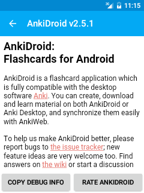

(link:help.html[English]) (link:help-ru.html[Русский]) (link:help-zh-CN.html[中文]) (link:help-ro.html[Română])

== お問い合わせの前に

お問い合わせの前に、link:manual-ja.html[AnkiDroid マニュアル]、AnkiDroidプロジェクトのサイトに掲載されている https://github.com/ankidroid/Anki-Android/wiki/FAQ[FAQ（よくある質問）]（英語）、そして http://wikiwiki.jp/rage2050/[PCソフト「Anki」のマニュアル]をお読みください。Ankiのマニュアルは、AnkiDroidを含むAnkiシステム全般の機能や特徴、注意点について知るのに役立ちます。

== サポート
お求めの情報が上記リンク先で見つからなかった場合は、下記の関連サイトをご覧ください。

AnkiDroidに限定されない問題に関するお問い合わせ :: AnkiDroid（AnkiのAndroidアプリ版）は、Ankiの作者 Damien Elmes 氏 が管理する他のバージョンのAnkiと異なり、有志グループによって独自に開発・管理されています。PCソフトAnki、Web版Anki（AnkiWeb）、iOSアプリ版Anki（AnkiMobile）等に関する問題や、AnkiDroidに限らずAnki全体に共通する問題については、「本家」であるAnkiの https://anki.tenderapp.com/[サポートページ] （英語）にお問い合わせください。

AnkiDroidに関するお問い合わせ :: AnkiDroidに関するお問い合わせは、 https://groups.google.com/forum/\#!forum/ankidroid-nihon[ユーザーフォーラム（日本語用）]に投稿するか、このフォーラムのmailto:ankidroid-nihon@googlegroups.com[アドレス]にメールしてください。（訳注：お問い合わせを英語で行う場合は、こちらの https://groups.google.com/forum/#!forum/anki-android[ユーザーフォーラム]に投稿するか、このフォーラムのmailto:public-forum@ankidroid.org[アドレス]にメールしてください。）

バグレポートや新機能リクエスト :: バグ（不具合）の報告や新機能のリクエストを送りたい場合は、まず https://github.com/ankidroid/Anki-Android/issues[AnkiDroidイシュートラッカー]（英語）に公開されているイシュー（課題）リストに同じ内容がないかどうか確認してみてください。
ない場合は、新しいイシューを作成し、できるだけ詳しい情報を記載してください。
バグ報告の場合は、下記の手順で「デバッグ情報」も記載してください。

1. 画面左上の「≡」の形のボタンをタップしてください。（ドロワーメニューが開きます。）
2. [設定]をタップしてください。
3. [拡張機能]をタップしてください。
4. [AnkiDroid について]をタップしてください。
5. 画面下の[デバッグ情報をコピー]をタップしてください。（「デバッグ情報」がクリップボードにコピーされます。）
6. ご使用中のAnkiDroidが入っているモバイル端末（スマホやタブレットなど）上で
https://github.com/ankidroid/Anki-Android/issues[AnkiDroidイシュートラッカー]を開いてバグレポートを書き上げた場合は、クリップボードの内容をそのレポート文中に直接貼り付けてください。または、（訳注：モバイル端末でこうしたレポートを書き上げるのは大変だと思う方などは、）端末のメール機能でメールを新規作成し、その本文にクリップボードの内容を貼り付け、そのメールをあなた自身に送信してください。それから、PC上でそのメールを開いて本文の内容をコピーし、PC上で（訳注：上記の https://github.com/ankidroid/Anki-Android/issues[AnkiDroidイシュートラッカー]を開いて）書き上げたバグレポートの文中に貼り付けてください。

++++++++++

++++++++++

この「デバッグ情報」は重要です。これがあると、サポートチームはあなたが書いたバグレポートとあなたのAnkiDroidが送信したクラッシュレポートとを照らし合わせることができます。

== AnkiDroidへの貢献
AnkiDroidはオープンソースプロジェクトです。このアプリの発展に貢献したいという方であればどなたでも（アプリ開発者でない方も）歓迎いたします。AnkiDroidへの貢献に関心を持たれた方は、最初にAnkiDroid公式サイトの https://github.com/ankidroid/Anki-Android/wiki/Contributing[“Contribution”]（貢献）のページ（英語）をご覧の上、 https://groups.google.com/forum/#!forum/ankidroid-nihon[ユーザーフォーラム（日本語用）]にお問い合わせください。

（訳注：お問い合わせを英語で行う場合は、こちらの https://groups.google.com/forum/#!forum/anki-android[ユーザーフォーラム]にお問い合わせください。）
