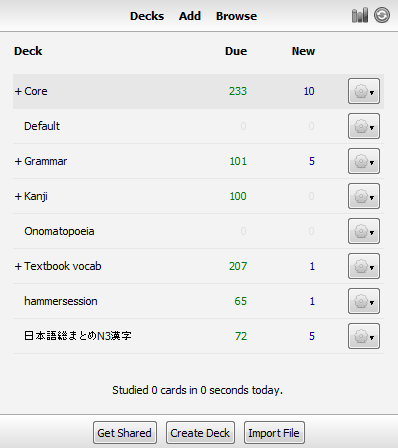

# 使用Anki的桌面AnkiDroid
Anki有一个免费的云同步服务称为AnkiWeb可以很容易的把你的卡牌在移动设备和电脑之间同步。如果你有一些不能使用同步的原因，使用USB这也是可能的，虽然这种方法更费力。

注意，AnkiDroid不隶属于它的桌面或AnkiWeb。AnkiDroid是基于它的桌面但它是由一个完全独立的志愿者社区开发的。

## 通过云同步
在您使用AnkiWeb之前，首先你需要创建一个帐户访问 [https://ankiweb.net](https://ankiweb.net)点击注册按钮。 如果你过去用过AnkiWeb，你可以跳过这一步。注册后，看到下面的相应的指令，这取决于你是否选择把你存在的牌组导入到AnkiDroid里面或从AnkiDroid导出。

### 同步现有的牌组到一个新的AnkiDroid安装
在这种情况下，你有一些现有的Anki牌组要通过同步AnkiWeb复制到一个新的AnkiDroid安装。打开Anki客户端与你现有的牌组（通常这会是Anki的桌面，但它也可能意味着一个版本的AnkiDroid你已经在另一个设备使用），然后单击“同步”按钮（其中有一个圈中的两个箭头）在牌组列表右上方。

如果你从未使用过ankiweb，在这之前如果提示，你需要输入你的凭据，然后按“上传AnkiWeb”按钮来确认你现有的AnKi里牌组是否与 AnkiWeb重合覆盖。AnKi将会上传你所有的卡片，图像和音频到AnkiWeb。如果你有很多媒体文件，这可能需要一些时间。

一旦同步完成，在设备上打开AnkiDroid可让你试图复制现有的牌组，点击顶部[牌组选择](牌组选择.md)的活动栏中的“同步”按钮。登录你的AnkiWeb信息后，AnkiDroid将下载你所有的卡片和媒体，并为下一次记住您的登录信息。

注意：在试图同步前如果你有任何存在的材料在AnkiDroid，你的上面会显示一条消息告诉你请你选择下载或上传到AnkiWeb。如果你乐意失去在AnkiDroid的卡片，它直接会选择“下载”。如果你需要与AnkiDroid合并现有的卡，那么你应该在继续前参阅[解决AnkiWeb的合并冲突](AnkiWeb冲突.md)部分。

第一个同步完成后，在你希望同步云变化的任何时候你都可以单击“同步”按钮，唯一的变化得是自上次同步被发送，随后的同步会更快。

如果您在桌面计算机上添加一些新的卡片，并希望同步到AnkiDroid，你会重复同样的基本过程：同步在桌面（或关闭程序，它自动同步关闭默认），然后在AnkiDroid点击同步按钮。

### 从AnkiDroid同步到计算机
从AnkiDroid同步计算机的过程基本上和从电脑同步AnkiDroid是相同的，但反过来就不同。

从[牌组选择](牌组选择.md)点击右上的同步按钮 (其中有一个圈中的两个箭头). 如果这是您第一次使用AnkiWeb，您可能需要输入您的登录信息，然后点击“上传”按钮上传你的AnkiDroid对AnkiWeb的收藏。

一旦同步完成，打开你的电脑Anki桌面版和按下同步按钮（在一圈两箭），AnKi将下载您的收藏。
