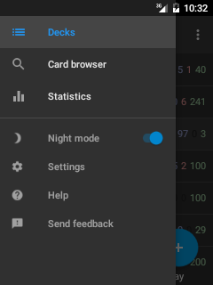

# 导航抽屉

在应用的大多页面，只要轻轻点击左上角的菜单图标，系统将打开导航抽屉，
或者你从屏幕的左侧向内轻轻活动，也可以打开导航抽屉. 它将用于
快速在应用的不同页面间切换，通过它你可以切换到下面的页面:

#### 牌组列表
带你进入应用的顶级页面，这里陈列着所有的牌组([牌组选择](牌组选择.md))

#### 卡片浏览器
显示一个所有的卡片列表 ([浏览](浏览器.md))

#### 统计
帮助你追踪你学习进度 ([more info in Anki manual](https://docs.ankiweb.net/stats.html#statistics) and [高级功能](高级功能.md))

#### 夜间模式
这个按钮将切换你的应用到暗色样式，很多用户发现这种样式可减轻眼睛疲劳，通常在光线暗的地方复习卡片时候用到。参阅维基 <a href="https://github.com/ankidroid/Anki-Android/wiki/Advanced-formatting#customize-night-mode-colors">wiki</a> 这里有关于在夜间模式下如何优化卡片背景和字体颜色的说明。

#### 设置
允许你设置各种选项来优化你的应用，使其更适合你的使用习惯 ([首选项](设置.md))

#### 帮助
打开当前这个网页

#### 提交反馈
从AnkiDroid团队获取支持
