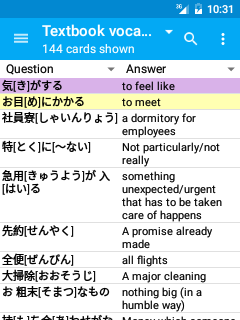

# 寻找/搜索/浏览
您可以通过点击来自[导航抽屉](抽屉.md)的“卡片浏览器”按钮来搜索或浏览卡片。

浏览器屏幕开始在当前选定的牌组上显示所有的卡片。您可以通过点击顶部的放大镜图标搜索选定的牌组上的卡片。你可以通过左上角的下拉列表来选择牌组，从而改变选择的牌组（或改变所有牌组）。

默认情况下，浏览器中的第一列给出了将问题显示的文本（即正面）的闪卡，第二列显示答案的文本（即背面）的闪卡。

第一列也可以被配置为显示一个更紧凑的显示的[“排序字段”](https://docs.ankiweb.net/editing.html#customizing-fields)。第二列通过点击列标题中的下拉菜单可以被配置为显示许多不同的参数。 

请注意，因为您的滚动通过卡片的列表，列的内容是动态计算的。

从搜索结果，你可以点击一张卡片来编辑它（见上面的[编辑笔记屏幕](编辑笔记.md)部分），或长时间点击它将显示一个菜单，允许你执行以下动作：

#### 标记/取消标记 笔记
从笔记中添加/删除“标记”标签。带有标记的笔记卡片被高亮显示在紫色中。

#### 暂停/取消暂停 卡片
暂停卡以黄色突出显示，并在复习过程中不显示。

#### 删除记录
请删除当前选定的卡片的说明，以及属于该说明的所有卡。如果没有从[自动备份](备份.md)（备份）恢复，此操作将无法撤消。

#### 预览  
渲染当前选定的卡，以便您可以看到它看起来像在审阅。

## 搜索
AnkiDroid支持所有的搜索字符串，它的桌面版本，允许你执行相当复杂的搜索。一些例子：

 #### 标签:标记 
 显示有标签“标记”的卡片

 #### 是:由于 
 只显示等待审阅的卡

 #### 正面:新手 
 显示只读卡片正面的字段正是“新手”

对于一个完整的可能性列表，请看本节中的[桌面手册](https://docs.ankiweb.net/searching.html)部分。

另外，一些更常用的过滤器（标记，暂停，和标签卡）可以快速地应用，而无需手动输入他们从溢出菜单选择他们。您也可以从菜单中保存和召回常见的搜索查询。
