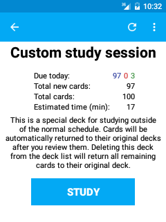

[[牌组概览]]
== 牌组概览屏幕
++++++++++

++++++++++
在牌组列表屏幕，点击数字区域，你将被带到牌组概览页面，在平板电脑上，它总是显示在牌组列表的右侧。

在这个屏幕上，你能够看到当前这个牌组的摘要信息，创建自定义学习选型，重建或清空过滤的牌组，改变记忆库选项。当这个屏幕可见的时候点击学习按钮，系统将带你进入这个牌组的学习页面。

=== 活动栏
活动栏上显示的图标将依赖于你当前打开的是普通牌组还是过滤牌组。

==== 普通牌组

自定义学习 :: 点击扳手图标将带你创建自定义会话，例如在正常学习安排之外增加额外的复习任务，或者当前牌组中某些卡片，要了解更多相关信息请参阅 <<filtered,filtered deck section>> 部分。

==== 过滤牌组

清空牌组 :: 点击叉号图标将清空当前过滤牌组中的所有卡片(例如：返回到他们原来的牌组中).

重建牌组 :: 点击重新创建图表，系统将根据过滤牌组选项中的设置重新创建生成过滤牌组。

==== 概览菜单

牌组选项 :: 允许你配置一些与当前牌组相关的选项，
例如每天学习的新卡片和复习的卡片数量。
了解更多关于学习选项的信息请参看 http://ankisrs.net/docs/manual.html#deckoptions[desktop documentation] 部分。

取消搁置 :: 这个选项只有当选择的牌组包含有被手动搁置或是自动搁置的卡片时候才会显示。
