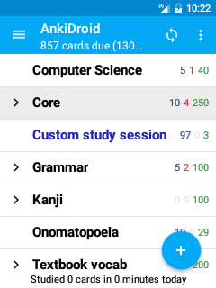

# The Deck List

<!-- toc -->

*_Note:_* _This section onwards assumes you understand what [decks and cards](https://docs.ankiweb.net/getting-started.html#key-concepts) are_

The deck list is the screen you see when you start AnkiDroid. It displays a list of the decks which contain all of your flashcards, and allows you to perform various actions:

## Add button
The big blue + button in the bottom right corner is used to add new material to AnkiDroid. Pressing it expands to give the following three options, which are also described in the [tutorial video](https://www.youtube.com/watch?v=F2K1gOSdIZA).

### Add
Choose this option if you want to create your own flashcards (notes) with AnkiDroid. "Notes" and "cards" have specific meanings in Anki, which are [explained in the main Anki manual](https://docs.ankiweb.net/getting-started.html#key-concepts). Please see the tutorial video for a quick introduction to adding notes, or refer to the [adding notes](adding-notes.md#add-note-screen) section below for more detailed information.

### Get shared decks
To download a deck of cards from the internet that another user has contributed:
 1. Ensure you're connected to the internet.
 2. Tap + and then **Get shared decks**. AnkiWeb will open.
 3. Select a category, or type in a search.
 4. Tap **Info** on a deck you'd like to study.
 5. Scroll down and tap **Download**.
 6. You browser will download the file and display a `download complete` notification. 
 Tap this button.
 7. AnkiDroid will appear, and show a confirmation dialog. Tap the **Add** button.
 8. When the import completes, your deck should be ready to study.

### Create deck
To create a new empty deck:
 1. Tap the **+** button and choose `Create deck`
 2. Choose a name for the deck, for example `New Japanese`
 3. Add cards to it following the `Add` instructions above

## App Bar
At the top of each screen in AnkiDroid is the App Bar, with buttons for performing various actions. 
The following actions are available from the app bar in the deck list:

### Navigation menu button
Tapping the icon on the far left will show the [left navigation menu](drawer.md#navigation-drawer) for quickly navigating between the main parts of the app.

### Sync button
The circular button with arrows on the right is for synchronizing your cards with the cloud, as described in the [adding decks from cloud](anki-desktop.md#using-anki-desktop-with-ankidroid) section.

### Overflow menu button
On the far right is the overflow menu which contains less commonly used actions. These actions are described further below.

**Hint:** long tapping on a button in the app bar anywhere in the app will display a textual hint describing what the button does!

## Studying a Deck
To study the cards in a deck, simply tap on the deck name (or the "STUDY" button on a 10" tablet), and AnkiDroid will switch to study mode. 

Note that the currently selected deck is highlighted with a grey background, and if you have any [filtered decks](filtered-deck.md#filtered-decks) they will be highlighted using a blue font. Filtered decks are discussed elsewhere in the manual.

## Other Deck Actions
Long tapping on a deck will show a list of other actions available to perform on that deck:

### Rename deck
Use this option to rename a deck

### Deck options
Tapping on deck options allows you to configure various deck specific study options.
Please see the [desktop documentation](https://docs.ankiweb.net/deck-options.html) for more information about these study options.

### Custom study
Allows you to choose from some convenient presets for studying outside of your normal schedule, for example increasing the study limit for the day. See the section on [filtered decks](filtered-deck.md#filtered-decks) for more detailed information.

### Delete deck
Use this option to delete a deck (note: this action is not reversible, although you can [restore from a backup](backups.md#automatic-backups)

### Export deck
This option can be used to share a deck with other users. See the [exporting decks](exporting.md#exporting-anki-files) section for more information.

### Unbury
This option is only visble when the selected deck has cards that have been manually or automatically buried.

### Rebuild / Empty
If the selected deck is a [filtered decks](filtered-deck.md#filtered-decks) then you also have the option to rebuild or empty the cards in it.

#### Clickable areas on the decks
Each deck in the list has three clickable areas:

### Deck expander
If you are using [subdecks](https://docs.ankiweb.net/getting-started.html#decks), then a deck expander button may appear on the far left of the deck, which can be used to show / hide the subdecks. A ▶ icon means the deck has hidden subdecks which can be shown, a ▼ icon means the deck has visible subdecks that can be hidden, and no icon means that the deck has no subdecks. 

**Note:** subdecks can be created by using the naming convention `PARENT::CHILD`.

### Deck name
This is the main clickable area, which will take you to the study screen if there are cards available to review.

### Count buttons
The count buttons on the far right of each deck act as a separate clickable area that takes you to the deck overview instead of the study screen. This can be useful if you want to quickly view the number of cards available in the deck.

## Advanced Actions
Some additional actions are located in the overflow menu for less common tasks, which are summarized below:

### Undo
After reviewing the last card in a study session, you can undo it from here.

### Check database
This can automatically fix a lot of problems with your database, and will also purge any unused tags. If you experience any problems with your collection, this is the first action you should try. 

>**NOTE:** Under some circumstances, check database will move cards to a deck named _!Recovered Cards_. If this occurs, please move the cards to an appropriate deck via the [card browser](browser.md#findingsearchingbrowsing), and delete _!Recovered Cards_ when it is empty.  

### Check media
Try to run this if you experience any issues with media syncing.

### Empty cards
Remove any empty cards from your collection. See the [desktop documentation](https://docs.ankiweb.net/templates/generation.html#card-generation--deletion) for more.

### Restore from backup
Allows you to restore from one of AnkiDroid's [automatic backups](backups.md#automatic-backups)

### Manage note types
Allows you to add, edit, and delete note types. See the [customizing card layout](advanced-features/customizing-card-layout.md) section for more help with this advanced feature.Keyboard Shortcuts

### Import
Import a .apkg anki file containing a deck. See the [importing](importing/importing-anki-files.md) section for more.

### Export collection
Export entire collection as a collection.apkg file. See the [exporting](exporting.md) section for more.

## Deck Counts
Next to each deck, three numbers are displayed. The left, blue number, corresponds to how many new cards you have to learn today. Anki will introduce 20 new cards a day by default, and you can customize this number if you'd like. The red number in the middle is for the cards due to be studied today which are currently in the learning phase, and the green number is the cards which are due for review (i.e. cards which have already graduated from the learning phase). On a deck you've never studied before, these numbers will both be zero.

As explained above, tapping on the counts will take you to the deck overview screen.