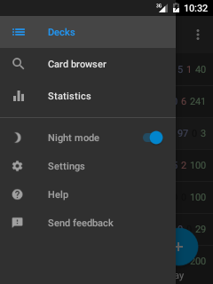

# Navigation Drawer

The navigation drawer can be opened from most places in the application by pressing the left menu icon, 
or alternatively swiping outwards from anywhere on the far left side of the screen. It is used
for quickly navigating between different parts of the application. You can switch to the following screens:

### Decks
Takes you to the top level of the app where the list of cards are shown ([more info here](deck-picker.md))

### Card Browser
Shows a list of all your cards ([more info here](browser.md))

### Statistics
Helps you track your study progress ([more info in Anki manual](https://docs.ankiweb.net/stats.html#statistics) and [here](advanced-features/advanced-statistics.md))

### Night mode
This switches the app to a dark theme which many users find is less straining on the eyes, particularly when reviewing in the dark. See the <a href="https://github.com/ankidroid/Anki-Android/wiki/Advanced-formatting#customize-night-mode-colors">wiki</a> for instructions on how to customize the card background and font color used in night mode.

### Settings
Allows you to customize the app ([more info here](settings.md))

### Help
Opens this web page

### Send feedback
Get support from the AnkiDroid team
