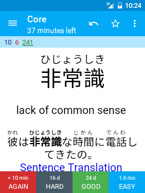

# Study Screen

Tapping on the deck name from the deck list, or the study button from the deck overview screen will take you to the study screen where you do your study. 

## Basics
If you have not used Anki on a computer before, you may like to have a look at the first [intro video](https://docs.ankiweb.net/getting-started.html#videos) before reading on, as it explains the basic review process.

On the top left of the screen you'll see three numbers. From the left, these correspond to new cards, learning cards, and cards to review. These are explained in more detail in the intro videos for the desktop program, so please [check them out](https://docs.ankiweb.net/getting-started.html#videos) if you haven't already.

When you've looked at a card's question and remembered the answer, or decided you don't know it, tap the **show answer** button. When you do, the bottom area will change to display 2-4 answer buttons, depending on how you've answered the card previously. The buttons will display the time a card will next be shown, so 10m means **10 minutes** and **5d** means **5 days**. You can tap directly on these buttons to choose a particular answer. 

To make reviewing faster, you can configure gestures (for example taps and swipes) to answer cards without using the buttons. See the [preferences section](settings.md) for more information on configuring gestures.

## App Bar
The App Bar at the top of the study screen has several buttons for performing various common actions. The number of buttons which are shown is determined automatically by Android based on the size and resolution of your screen. If there is not enough space to show the button for a given action, then the action will be available from the menu instead. If you are unsure what a button does, you can long-tap on it to see the name of the action. The following action are available:

#### Undo
Undo the answer you chose for the last card you studied (button always shown).

#### Mark Card
Adds a **marked** tag to the current note, so it can be easily found in the browser. 
This is useful when you want to take some action on the note at a later date, such as looking up a word when you get home. Marked cards also show a small star in the upper-right-hand corner during reviews.

#### Flag Card
Adds a color coded **flag** (red, orange, green, or blue)
This can be used as a general purpose indicator to differentiate your cards. Flags are represented by a number from 1-4, corresponding to the previously listed colors.

#### Edit Card
Open the edit note screen, where you can change the content displayed on the flashcard (see the [editing notes section](editing-notes.md) for more help)

#### Hide / Delete
Give options to bury, suspend, or delete the current note or card

- **Bury card / Bury note:** Hides a card or all of the note’s cards from review until the next day. (If you want to unbury cards before then, you can choose “unbury” from the long-press menu in the [deck list](deck-picker.md), or from the [deck overview screen](deck-overview.md).) This is useful if you cannot answer the card at the moment or you want to come back to it another time. Burying can also happen automatically for cards of the same note. If cards were in learning when they are buried, they are moved back to the new card queue or review queue prior to being buried.
- **Suspend card / Suspend note:** Hides a card or all of the note’s cards from review until they are manually unsuspended (by long-tapping a card in the [card browser](browser.md)). This is useful if you want to avoid reviewing the note for some time, but don’t want to delete it. If cards were in learning when they are suspended, they are moved back to the new card queue or review queue prior to being suspended.
- **Delete note:** Deletes the note and all of its cards.

#### Replay Audio
If the card has audio on the front or back, it will be played again.

#### Enable / Disable Whiteboard
This action enables or disables the whiteboard feature for the current deck. The whiteboard feature allows you to draw on the screen, which is particularly useful for practicing drawing characters from languages such as Japanese. When the whiteboard has been enabled for the current deck, two new actions will become available for clearing and hiding the whiteboard. Disabling the whiteboard will hide these actions as well as the whiteboard itself.

#### Deck options
Open the deck specific study options. See the [desktop documentation](https://docs.ankiweb.net/deck-options.html) for more information about these study options.

#### Check Pronunciation
This action enables or disables the temporary audio recorder toolbar at the top of the card. This feature allows you to record your voice and replay it. It is used primarily to check your pronunciation. This toolbar is composed of three buttons: play, stop playing and record microphone audio. This tool can be used while viewing either the question or the answer.

## Reaching the end of the study session
When you've finished the cards that are due to be studied today, you'll be taken back to the decks list and shown a congratulations message. From here you can select a different deck, or if you've finished studying for the day, you can simply tap the home button in order to close AnkiDroid (and you can also do this in the middle of reviews if you wish).

If you wish to keep studying the same deck further, tap on the deck again which will give you several options for continued study. Please see the [filtered deck](filtered-deck.md) section for more on custom study.
